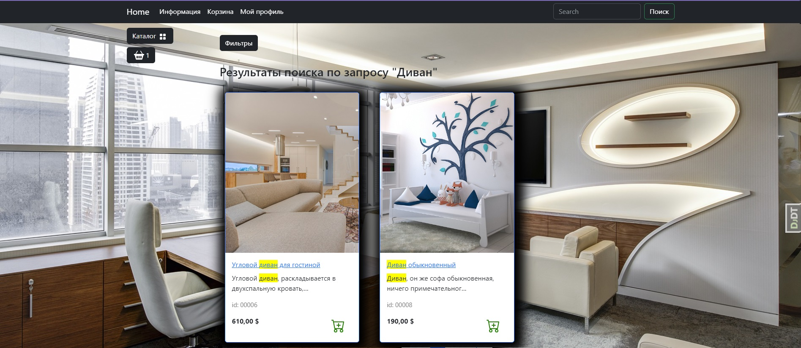

# Online-furniture-store

## About
This is an educational project with an online furniture store designed to explore the capabilities of the Django framework.

As part of the project, I've studied the architecture of the Django project, addressing and pagination mechanisms and how to perform CRUD database operations (PostgreSQL was connected) within Django ORM, configure the administrative panel. I've also managed to work a little with ajax requests to display changes without reloading the page.
***

## Apps overview
The project consists of 5 apps, each of which represents its logical part of the site's functionality: *main*, *users*, *goods*, *carts*, *orders*.

* *Main* app is responsible for displaying the main and "about us" page.

* *Users* app is responsible for working with users, which includes registration, logging in and out of the personal account, as well as working with the profile.

* *Goods* app is responsible for storing and representing the catalog and information about products.

* *Carts* app is responsible for work with cart.

* *Orders* app is responsible for making orders.

***

## Main

Main page

About us page

***

## Users

Registration page

Authentication page

Both registration and authentication forms are validated and in case of any errors, special messages are shown. As for example, there is an error on authentication page on the picture below.

Profile page

***

## Goods

Catalog page, where products can be shown by the chosen category from the drop-down menu on the left.

This is how products can be filtered.

It is also posible to search by words in the title and description.

Product page

***

## Carts

Cart card opened from left menu.

Cart card opened from top menu.

Amount of products in the cart can be increased by pressing cart-item button on the product card as well as by "+" button in the cart. Decreasing of the amount can be done with "-" button and deleting with bin-item button in the cart.

Cart card can also be seen in the profile as it was shown on the profile page. Carts can be filled by both authorized and unauthorized users. In the latter case, the binding will not go to the user's ID, but to the session key and after registration or authorization all products in cart of unauthorized user will be moved to his profile's cart.
***

## Orders

User's orders are shown in his profile.

Order can be made after pressing the corresponding button in the cart. The necessary information for the order filled in the profile is pre-filled in order form. This is how making order page looks like.

Order form is validated and in case of any errors, special messages are shown. Example is below.

